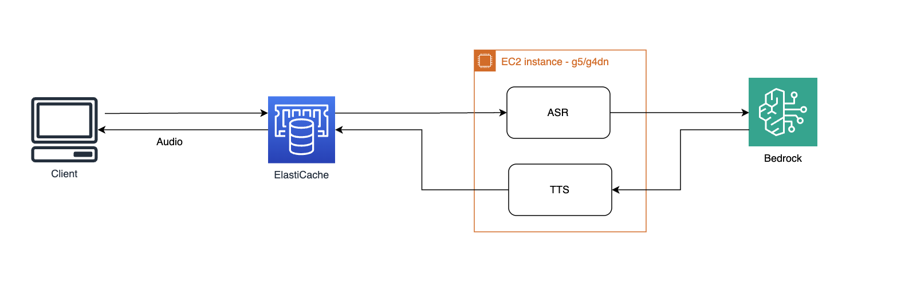
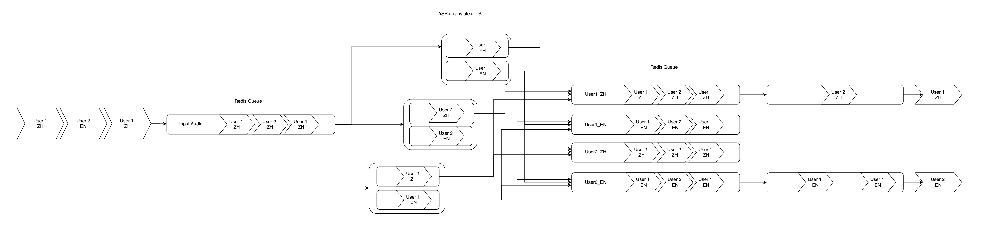
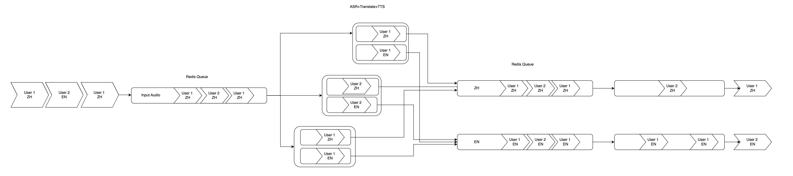
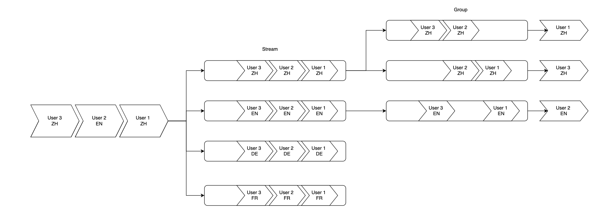

# 项目介绍

## Faster-whisper 模拟实时语音转写

环境：Python11，CUDA 11


<figure style="text-align: center; radius:10pt">
    
</figure>
<div align="center">

<a href='https://follow-your-click.github.io/'></a>   [](https://github.com/ultrasev/stream-whisper)
</div>

## Bedrock Claude3 Haiku 翻译

## Chatts 文字转语音

## 项目架构

<figure style="text-align: center; radius:10pt">
    
</figure>

## Redis 队列

master 分支和 multi_langs 分支实现略有不同，master 分支支持中英文多个用户， multi_langs 仅支持中英文各一个用户

<figure style="text-align: center; radius:10pt">
    
</figure>


<figure style="text-align: center; radius:10pt">
    
</figure>

可在 multi_langs 分支上拓展使用 redis stream 和 group 来支持每个语言多用户使用

<figure style="text-align: center; radius:10pt">
    
</figure>

# 使用方法


## ElastiCache Redis安装 
测试可以使用ElastiCache Redis Serverless版本

## 拆分服务端与客户端
适合 GPU 在云端的场景。测试场景：g5/g4dn+ubuntu 22
### 服务端
负责接收客户端发送的音频数据，进行语音识别，完成翻译，然后把研发文字通过TTS转换为音频结果返回给客户端。
```bash
git clone https://github.com/chenxqdu/stream-whisper
apt -y install libcublas11
cd stream-whisper
pip install -r requirements.txt
pip install --force-reinstall ctranslate2==3.24.0
```

注：
- `libcublas11` 是 NVIDIA CUDA Toolkit 的依赖，如果需要使用 CUDA Toolkit，需要安装。

把 `.env` 文件中的 `REDIS_SERVER` 改成自己的 Redis 地址，然后运行 `python3 -m src.server`，服务端就启动了。
第一次执行时，会从 huggingface 上下载语音识别模型，需要等待一段时间。Huggingface 已经被防火墙特别对待了，下载速度很慢，建议使用代理。

.env样例
```
REDIS_SERVER=rediss://r-noel2j.serverless.usw2.cache.amazonaws.com:6379 
```

### 客户端
负责录音，然后把音频数据发送给服务端，接收服务端返回的识别结果。

```bash
# Mac M Series
CONDA_SUBDIR=osx-arm64 conda create -n stream-whisper python python=3.11.8 -y
# Mac Intel Series
# conda create -n stream-whisper python python=3.11.8 -y

conda activate stream-whisper
brew install portaudio
pip install --global-option='build_ext' --global-option="-I$(brew --prefix)/include" --global-option="-L$(brew --prefix)/lib" pyaudio

git clone https://github.com/chenxqdu/stream-whisper
cd stream-whisper
pip install -r requirements.txt
pip install --force-reinstall ctranslate2==3.24.0

# mac only
pip install PyObjC
```

注：
- `portaudio19-dev` 是 pyaudio 的依赖，如果系统已安装，可以忽略。

同样需要把 `.env` 文件中的 `REDIS_SERVER` 改成自己的 Redis 地址，在本地机器上运行 `python -m src.client_{$lang}`，客户端就启动了。运行前先测试一下麦克风是否正常工作，确认能够正常录音。

需要通过在公有子网跳板机访问Redis，例如已经在ssh config中配置了jump-server-us-west-2
```
ssh -f -N -L 6379:r-noel2j.serverless.usw2.cache.amazonaws.com:6379 jump-server-us-west-2
```
.env样例
```
REDIS_SERVER=rediss://127.0.0.1:6379
```

# 原项目仅部署 whisper 部分
## 本地直接运行
如果本地有 GPU，可以直接运行 `src/local_deploy.py`，这样就可以在本地直接运行服务端和客户端了。
```bash
git clone https://github.com/ultrasev/stream-whisper
apt -y install portaudio19-dev  libcublas11
python3 src/local_deploy.py
```

## Docker 一键部署自己的 whisper 转写服务
```bash
docker run -d --name whisper \
    -e MODEL
    -p 8000:8000 ghcr.io/ultrasev/whisper
```
接口兼容 OpenAI 的 [API 规范](https://platform.openai.com/docs/guides/speech-to-text)，可以直接使用 OpenAI 的 SDK 进行调用。

```python
from openai import OpenAI
client = OpenAI(base_url="http://localhost:8000")

audio_file= open("/path/to/file/audio.mp3", "rb")
transcription = client.audio.transcriptions.create(
  model="whisper-1",
  file=audio_file
)
print(transcription.text)
```
